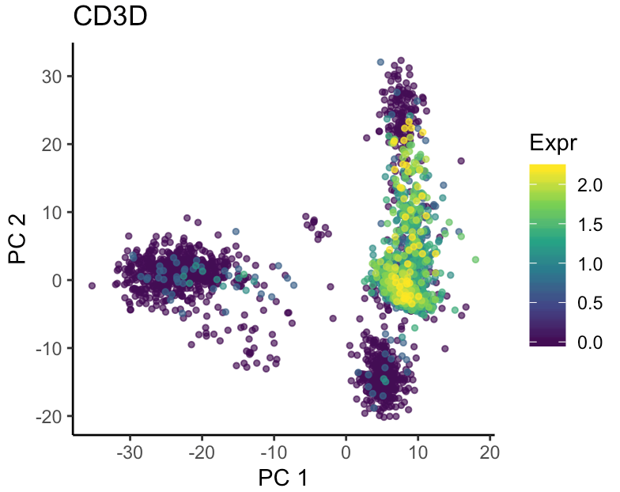

# scExplore

R package for single-cell data visualization

## Instalation

```r
devtools::install_github("powellgenomicslab/scExplore")
```

## Examples

Plot merged gene expression signal to detect *CD8+ T cells*

```r
plotMerge(pbmc, gene1 = "CD3D", gene2 = "CD8A")
```


Plot expression of `CD3D` in pca

```r
plotFeature(pbmc, "CD3D", reduction = "pca")
```




Plot clusters

```r
plotFeature(pbmc, "seurat_clusters")
```


